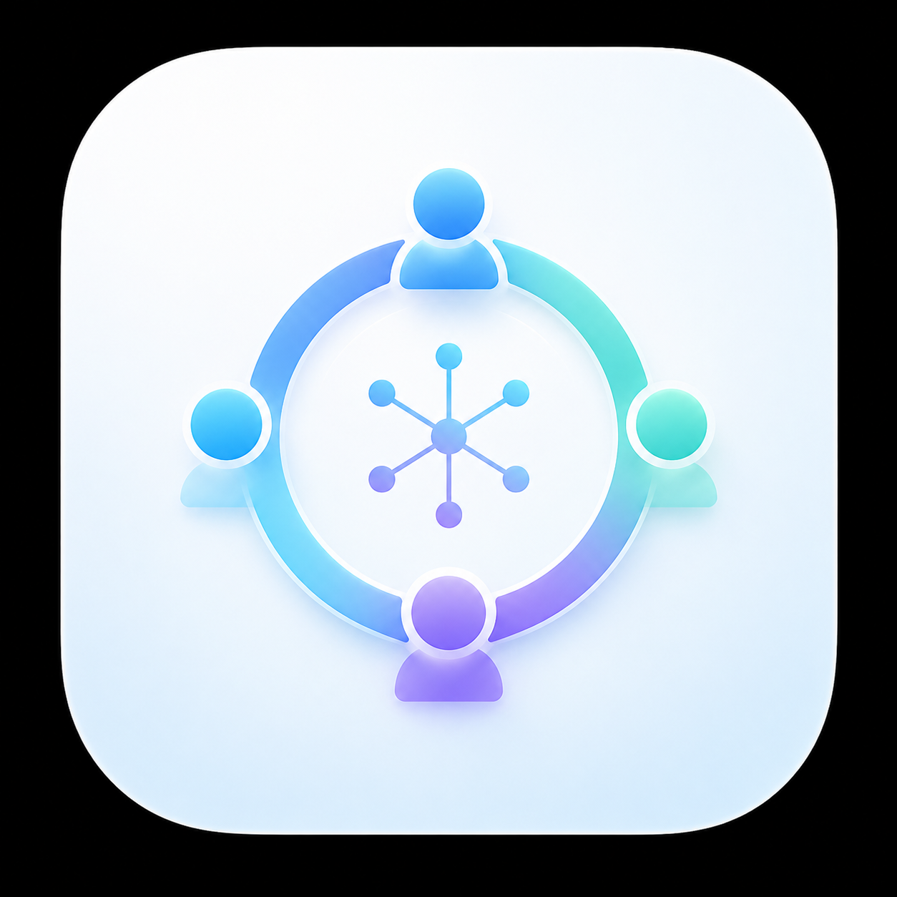

# AI Roundtable

<p align="center">
  
</p>

一个无需 API Key 的本地多 AI 圆桌应用。它把问题交给多个互相隔离的参与者，依次执行独立回答、匿名交叉评审、方案修订、结构化裁判评分和主持人综合，并将全过程保存在本地 SQLite 中。

完整闭环由离线模拟 AI 提供，因此没有任何平台账号、API 或网络也可以运行。GPT、Kimi、元宝、豆包和 DeepSeek 的官方网页适配器属于**实验性功能**：首次由用户在五个独立 Edge 配置中登录，之后软件自动发送提示词并采集回答，不要求用户复制粘贴。

## 已实现能力

- 3 个不同立场的离线模拟 AI：证据分析、审慎质疑、务实执行。
- `asyncio` 并发执行标准五阶段；参赛裁判自动切换为并行的无利益冲突评审团，五 AI 单轮约 21 次、四 AI 单轮约 17 次网页交互。
- 匿名评审、多轮评审/修订、留一法交叉评分、八维加权决策分、硬门槛、强制排名和明确淘汰结论。
- 单个 AI 超时或失败时错误隔离、重试记录和其余参与者继续执行。
- 三栏 PySide6 群聊 UI：五平台图片头像、独立气泡、阶段进度、登录向导、错误操作、主持结论、协同增益、逐轮效果对比和八维评分雷达图。
- 参与者、运行模式、主持/裁判、轮数、匿名互评和修订设置均即时生效并自动保存；复选框整块区域可点击，运行期间会明确锁定当前轮配置。
- AI 网页返回的结构化数据只在内部解析，聊天气泡统一转换为自然语言标题、段落和项目符号；流式阶段不显示半截 JSON。
- Playwright + 独立持久化 Edge 配置自动填写、发送和读取；不会复用或修改用户主 Edge 配置。
- 每个平台使用独立适配器、选择器配置和浏览器目录，页面变化不会连带其他平台。
- 全自动模式失败时自动重试一次，仍失败则跳过该平台；至少两个有效 AI 即可继续。
- 提供“四 AI 测试（无 GPT）”预设，只启用 Kimi、元宝、豆包、DeepSeek；只要选择任一在线 AI，三个离线模拟 AI 会被自动排除。
- 保留显式“人工备用”模式，但全自动模式不会弹出复制粘贴回答窗口。
- SQLite 保存完整讨论快照、阶段事件、错误和人工回答。
- 每次讨论生成独立、脱敏的 `logs/run_<讨论ID>.jsonl`，同时保留滚动 `application.log`；日志不写提示词和回答正文。
- 一键复制，导出 Markdown、JSON 或另存完整讨论记录。
- 二次确认后清除讨论、日志、导出和浏览器本地登录配置。
- 日志认证字段脱敏；发送前隐私提醒；导出文件包含隐私提示。

## 重要合规说明

网页自动化可能受平台服务条款、页面更新、账号状态、验证码和反自动化机制影响。使用者必须遵守各平台服务条款和适用规则。

本项目：

- 不使用 AI 平台 API、API Key 或开发者接口；
- 不保存用户密码；
- 不读取、导出或记录 Cookie、Token 等认证数据；
- 不绕过登录、验证码、访问限制或安全机制；
- 不隐藏自动化行为，不规避平台检测；
- 不提供批量注册、账号共享、代理池等规避限制的功能；
- 遇到验证码时要求用户在官方网页自行处理，或跳过该平台。

浏览器登录数据仅存在于项目的 `browser_profiles/` 本地目录中，并已加入 `.gitignore`。不要把该目录复制给他人。

## 环境要求

- Python 3.11 或更高版本
- Windows 10/11（当前首版在 Windows + Python 3.13.9 + PySide6 6.9.2 上验证）
- PySide6 6.7+
- Pydantic 2.7+
- Playwright 1.45+ 和已安装的 Microsoft Edge，用于独立持久化网页上下文

## 安装

在 PowerShell 中进入项目目录：

```powershell
cd C:\Users\Liyz\Desktop\py\AIroundtable
python -m venv .venv
.\.venv\Scripts\Activate.ps1
python -m pip install --upgrade pip
python -m pip install -r requirements.txt
```

如果当前电脑已安装满足版本要求的 PySide6、Pydantic 和 pytest，也可以直接运行，无需创建新环境。

### 安装网页自动化

`requirements.txt` 已包含 Playwright。也可单独运行：

```powershell
.\scripts\install_browser.ps1
```

或：

```powershell
python -m pip install "playwright>=1.45,<2"
```

安装 Playwright 不代表网页选择器一定兼容，也不会绕过平台验证。

## 启动

桌面界面：

```powershell
python main.py
```

也可以运行：

```powershell
.\scripts\run.ps1
```

无界面完整离线演示并自动导出：

```powershell
python main.py --demo "如何用两周设计一个低风险、可回滚的产品试点？"
```

无头 UI 启动检查：

```powershell
python main.py --smoke-test
```

## 首次使用

1. 点击“启用全自动五 AI”，在向导中选择“一键打开五个独立 Edge”。
2. 首次分别登录 GPT、Kimi、元宝、豆包和 DeepSeek；应用不接收密码。登录状态保留在五个项目专用目录中。
3. 在底部输入主题，可展开补充背景与约束。默认 GPT 主持、Kimi 裁判。
4. 点击“发送主题”，阅读隐私提示并确认。
5. 中间群聊用自然语言显示用户主题、AI 气泡、生成进度、匿名互评、修订、评分和主持总结。
6. 独立回答阶段会等待全部 AI 停止生成，再显示“全员完成屏障”并进入匿名互评。
7. 软件自动填写提示词、发送并读取回答；平台失败时自动重试一次，仍失败则显示错误并跳过。
8. 右侧查看结论、共识、分歧、协同增益、关键取舍、验证计划、平均分和雷达图，并复制或导出。
9. 左侧历史记录可重建完整群聊；点击“打开运行日志”可查看本轮诊断记录。

## 五平台登录与全自动运行

新安装首次启动会选中在线五 AI；五个平台仍标记为“实验性”。首次尝试：

1. 打开“登录向导”，一键打开五个官方登录页。
2. 在应用管理的独立 Edge 窗口中自行登录并确认；五个配置分别存放在 `browser_profiles/chatgpt`、`kimi`、`yuanbao`、`doubao` 和 `deepseek`。
3. 登录完成后，自动模式负责全部填写、发送和回答采集。
4. 选择器、验证码、加载或浏览器问题会显示原因；自动重试仍失败时跳过该平台，不弹出人工粘贴窗口。
5. 未安装 Playwright 时全自动平台会明确报错；可安装依赖或改用离线演示。

五个平台选择器分别位于 `configs/*_selectors.json`，均明确标记为实验性；新增 DeepSeek 选择器尚未做真实账号端到端验证。验证码、人工验证、页面变化或平台限制不会被绕过。

## 讨论流程

1. **差异化独立回答**：所有参与者并发处理原始问题，彼此看不到答案，并分别承担证据、反例、执行、系统影响、用户价值等互补视角。
2. **融合式匿名互评**：每个参与者用一次调用评审其他全部方案，提取独有贡献、跨方案组合点和用于裁决冲突的测试。
3. **协同修订**：参与者会看到其他匿名方案的精简语义内容，明确记录吸收的思想、解决的冲突和组合产生的新价值；可设置 1–3 轮。
4. **无利益冲突的比较式评分**：Kimi 仍是界面中的首席裁判；如果裁判同时参赛，系统自动让全部成功参与者组成评审团，并对每位评审者硬性隐藏其自己的讨论前与修订后方案。正常情况下每个候选获得相同数量的 `N-1` 份非作者评分；即使模型擅自输出自评分，解析器也会丢弃。若评审者失败或缺项，系统按所有候选的共同可用票数对齐，避免多一票的候选占优。首轮同时评估独立答案基线和第 1 轮修订，后续沿用同一八维标尺。
5. **明确选边的主持综合**：默认采用裁判第一名；主持人若要改选，必须提供至少两条可核验的新证据。不得并列推荐或平均拼接互相冲突的方案，同时保留未采纳但可能正确的少数意见。

评分结果会显示每个 AI 在每一轮的决策分变化、八个维度分别提升或退步的幅度，以及该轮总体属于“有效提升、基本持平或出现退步”。畸形批量 JSON 会按候选项恢复；缺失评分不会再被伪造成统一的 5 分。

网页原始文本、历史状态、错误信息和旧轮次嵌套 JSON 不会回灌给下一轮；格式异常时只保留有长度上限的自然语言内容，避免提示词随轮次指数膨胀。

所有阶段共享的规则位于 `app/prompts/templates.py`，包括不编造事实、多数意见不等于正确、区分事实/推测/观点/建议和主动纠错。

## 项目结构

```text
AIroundtable/
├─ main.py                         # GUI、离线演示和启动检查入口
├─ README.md
├─ TECHNICAL_DESIGN.md
├─ pyproject.toml
├─ requirements.txt
├─ app/
│  ├─ core/                        # 枚举、异常
│  ├─ models/                      # Pydantic 数据契约
│  ├─ orchestration/               # 并发阶段引擎与事件
│  ├─ prompts/                     # 提示词和讨论规则
│  ├─ providers/                   # 统一接口、模拟、人工、五个隔离网页适配器
│  ├─ services/                    # 导出、隐私、本地清理
│  ├─ storage/                     # SQLite 仓库
│  ├─ ui/                          # 群聊、登录向导、雷达图和后台事件循环
│  └─ utils/                       # 安全日志
├─ configs/                        # 网页选择器与未实现平台模板
├─ browser_profiles/               # 本地登录配置（Git 忽略）
├─ data/                            # SQLite（Git 忽略）
├─ exports/                         # 导出（Git 忽略）
├─ logs/                            # 滚动主日志和逐轮脱敏 JSONL（Git 忽略）
├─ scripts/
└─ tests/
```

统一适配器接口在 `app/providers/base.py`。增加平台时应新建独立适配器和独立选择器配置，不要把网页选择器写进编排或 UI。

## 数据与恢复

数据库默认路径为 `data/roundtable.sqlite3`。每次阶段切换、错误和完成都会保存快照或事件。核心模型包括：

- `ProjectConfig`、`ProviderConfig`、`ProviderSession`
- `UserQuestion`、`AIResponse`、`ReviewComment`、`RevisedResponse`
- `JudgeScore`、`DiscussionRound`、`FinalSynthesis`、`ErrorRecord`
- `DiscussionRecord`（用于完整快照和恢复）

“清除登录状态和全部本地数据”会清空数据库内容，并删除 `browser_profiles/`、`exports/` 和 `logs/` 中的运行数据。该按钮有不可恢复警告和二次确认。

## 测试

```powershell
python -m pytest
```

当前测试覆盖：模型校验、自然语言气泡、流式 JSON 隐藏、全员完成屏障、脱敏逐轮日志、五平台注册表、严格全自动无人工提示、人工备用、四 AI 17 次无利益冲突协议、12 条互评拆分、自评分注入拦截、畸形评分恢复、加权决策分、逐轮效果对比、在线主持接力、裁判/本地主持回退、至少两份有效回答、多轮、并发、单平台失败、取消、稳定调用 ID、瞬时进度不落库、SQLite、历史恢复、导出、复选框真实鼠标点击、设置自动保存与重启恢复、图片头像、阶段条、雷达图和无头启动。

本次交付验证结果：

```text
43 passed
```

还可以单独验证语法和启动：

```powershell
python -m compileall -q app main.py
python main.py --smoke-test
```

## 故障排查

### `ModuleNotFoundError: PySide6`

运行 `python -m pip install -r requirements.txt`，并确认安装依赖与启动应用使用同一个 Python：

```powershell
python -c "import sys, PySide6; print(sys.executable, PySide6.__version__)"
```

### Playwright 或 Edge 自动模式不可用

运行 `scripts/install_browser.ps1` 或 `python -m pip install -r requirements.txt`。自动模式使用 `channel="msedge"`，不会使用主 Edge 用户目录。

### 网页找不到输入框/发送按钮

页面结构可能已经变化。应用会自动重试并跳过失败平台。选择器集中在五个平台各自的 JSON 配置中，修改前应在自己的已登录页面核实，并继续遵守平台条款。

### 出现验证码或“验证你是人类”

在官方网页中自行处理。程序不会绕过。无法完成时跳过该 AI，其他 AI 会继续。

### 某个 AI 超时、拒绝、返回空内容或浏览器被关闭

错误气泡会显示原因。程序会先记录发送前已经存在的历史错误提示，只把本次发送后新出现的“请求失败、服务繁忙、网络异常、内容过长”等提示视为当前调用错误；发送后 90 秒仍没有新回答会快速失败，单次调用最长 180 秒。全自动模式重试一次后跳过；至少两个 AI 的独立回答成功才会继续，不足两个时停止并明确报错。若指定主持人没有有效方案或最终综合失败，会优先由健康且未担任裁判的在线参与者接力；接力仍失败才使用明确标记的低可信度本地降级综合器。

### 反馈运行问题

先点击左栏“打开运行日志”，按修改时间找到最新的 `run_<讨论ID>.jsonl` 和 `application.log`。逐轮日志只包含阶段、平台、状态、调用 ID、重试和耗时，不包含问题或回答正文。后续排查本项目时应优先查看这两个日志。

### 内容超过平台上下文长度

提示词生成器会对汇总材料做安全截断并标记。复杂问题建议减少轮数、参与者或背景长度；不要把截断后的结果当成完整材料。

### 数据库无法写入

确认项目目录可写、磁盘空间充足，并且没有安全软件锁定 `data/roundtable.sqlite3`。不要让多个应用进程同时清除本地数据。

## 平台兼容性与诚实状态

| 平台 | 状态 | 登录状态 | 发送/读取 | 验证情况 |
|---|---|---|---|---|
| 模拟分析师 | 完整离线实现 | 不需要 | 自动 | 已测试 |
| 模拟质疑者 | 完整离线实现 | 不需要 | 自动 | 已测试 |
| 模拟执行顾问 | 完整离线实现 | 不需要 | 自动 | 已测试 |
| 通用人工回填适配器 | 完整安全流程 | 用户自行处理 | 人工发送和回填 | 已单元测试 |
| GPT 官方网页 | 实验性 | 独立 Edge | 全自动，失败跳过 | 未进行真实账号端到端测试 |
| Kimi 官方网页 | 实验性 | 独立 Edge | 全自动，失败跳过 | 真实账号已完成独立回答、互评、修订和评分实测 |
| 元宝官方网页 | 实验性 | 独立 Edge | 全自动，失败跳过 | 真实账号已连接；历史错误标记修复后待复验 |
| 豆包官方网页 | 实验性 | 独立 Edge | 全自动，失败跳过 | 真实账号已完成独立回答、互评和修订实测 |

不要把一次成功实测解释为稳定支持网页自动操作。当前环境已安装 Playwright；既有平台仍需按账号逐一复验，新增 DeepSeek 尚未完成真实账号端到端验证，因此所有网页适配器继续按实验性能力交付。

## 当前已知限制

- 模拟 AI 使用确定性预设逻辑，不具备通用语言模型的知识与推理能力，也不核验实时事实。
- 五个平台页面选择器可能随时变化；平台条款也可能限制自动化。
- 全自动模式不人工接管；失败平台自动重试一次后跳过。显式“人工备用”模式仍可单独选择。
- 历史恢复用于查看/导出已保存快照，不能从任意中间阶段无损续跑外部网页会话。
- 参赛裁判采用留一法评审团并使用平均加权决策分与平均名次聚合，可消除直接自评分，但仍不是统计置信区间，也不能消除模型间量尺漂移或证明事实正确。
- Windows 为主要验证环境；macOS/Linux 未做 GUI 和系统浏览器实机测试。

## 后续优先级

1. 实现阶段级断点续跑和单个失败 AI 的可审计重试/合并机制。
2. 增加用户可视化选择器诊断器与版本化适配器健康检查，减少网页变化维护成本。
3. 增加本地可插拔模型适配器（例如用户本机推理服务，但保持默认无 API），并加入事实核验来源与引用审计。
