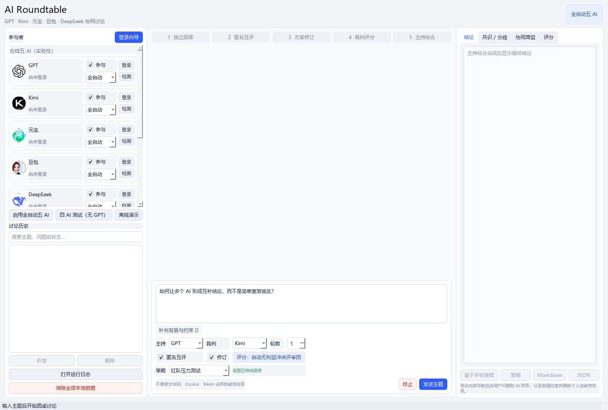
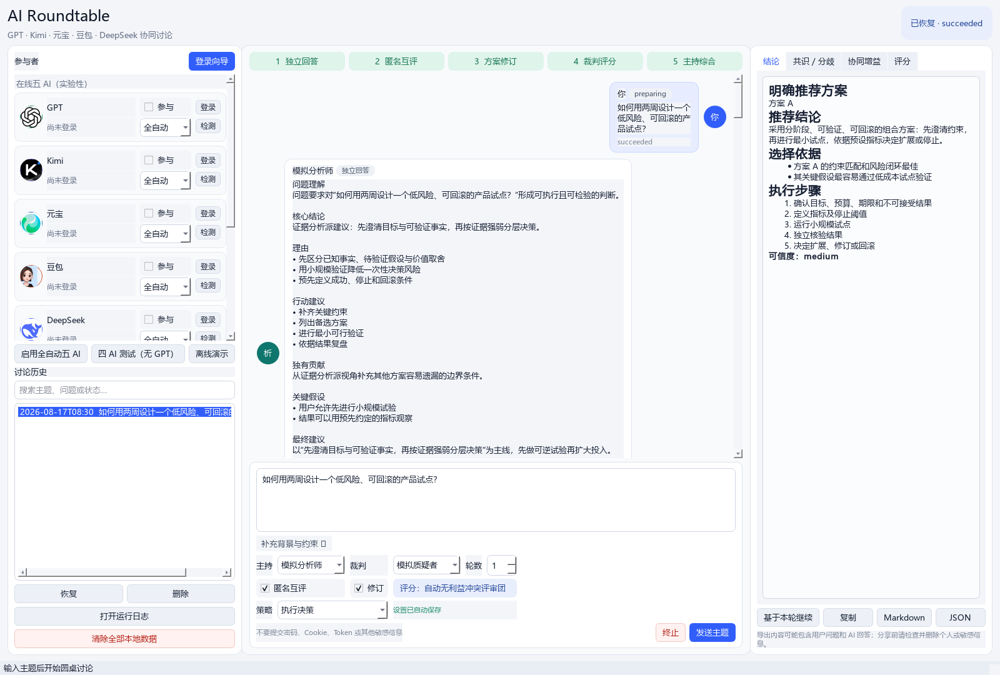

<div align="center">


# AI Roundtable

**让多个 AI 先独立思考，再互相挑错、修订、评分，最后形成一份明确结论。**


</div>

AI Roundtable 是一个本地 PySide6 桌面应用。它不把多个回答简单并排展示，而是执行一套可审计的五阶段协议：**独立回答 → 匿名互评 → 协同修订 → 无利益冲突评分 → 主持综合**。

在线模式直接操作用户已登录的 GPT、Kimi、元宝、豆包和 DeepSeek 官方网页，不需要 API Key；离线模式内置三个模拟 AI，可在没有账号、API 或网络时体验完整流程。

> [!IMPORTANT]
> 网页适配器属于实验性能力。页面结构、验证码、账号状态或平台规则变化都可能导致自动化失败；软件不会绕过验证码或安全限制。



<p align="center"><em>真实软件截图：左侧管理参与者与历史，中间显示五阶段群聊，右侧汇总结论与评分。</em></p>

## 为什么不只是“同时问五个 AI”

| 常见多 AI 工具 | AI Roundtable |
|---|---|
| 多份回答并排展示，仍由用户自己拼接 | AI 必须匿名互评、修订并给出组合依据 |
| 裁判可能给自己最高分 | 参赛裁判看不到自己的候选方案，自评分会被解析器丢弃 |
| 主持人容易平均主义或“端水” | 必须给出唯一排名、推荐项、淘汰项和选择依据 |
| 只展示最终答案 | 保存独立回答、互评、修订、评分、分歧和完整运行日志 |
| 无法判断讨论是否有用 | 比较讨论前后八维评分，显示每轮提升与退步 |

## 30 秒开始体验

### 方式一：离线演示（推荐首次使用）

```powershell
git clone https://github.com/LiYZ916/AIroundtable.git
cd AIroundtable
python -m pip install -r requirements.txt
python main.py
```

软件打开后点击左侧 **“离线演示”**，输入主题并点击 **“发送主题”**。三个模拟 AI 会在本地完成整个五阶段流程。

也可以直接运行无界面演示：

```powershell
python main.py --demo "如何用两周设计一个低风险、可回滚的产品试点？"
```

### 方式二：连接五个官方网页

1. 启动软件，点击 **“登录向导”**。
2. 一键打开五个由应用管理的独立 Edge 窗口。
3. 用户自行登录 GPT、Kimi、元宝、豆包和 DeepSeek；软件不接收密码。
4. 返回软件检测登录状态，选择参与者、主持、裁判和讨论策略。
5. 发送主题后，软件自动填写提示词、等待回答完成并读取结果。

五个平台使用彼此隔离的 `browser_profiles/<provider>`，不会接管或修改用户的主 Edge 配置。

## 实际界面

### 五 AI 群聊工作台

- **左栏**：平台头像、参与开关、自动/人工模式、登录检测、历史搜索和运行日志。
- **中栏**：五阶段进度、自然语言聊天气泡、背景与约束、讨论策略、主持和裁判设置。
- **右栏**：明确推荐、共识/分歧、协同增益、八维雷达图和逐轮效果对比。

### 离线完整讨论结果



<p align="center"><em>真实软件截图：五个阶段均已完成，聊天区保留过程，右侧给出明确推荐与执行步骤。</em></p>

截图可以从当前代码重新生成：

```powershell
python -m scripts.capture_readme_screenshots
```

脚本使用内存存储和离线模拟数据，不读取现有数据库、浏览器登录信息或用户讨论内容。

## 五阶段圆桌协议

| 阶段 | 系统行为 | 解决的问题 |
|---|---|---|
| 1. 独立回答 | 所有参与者并发回答，彼此看不到答案，并承担不同分析视角 | 防止锚定和相互模仿 |
| 2. 匿名互评 | 每个 AI 批量审阅其他方案，提取独有贡献、逻辑缺口和裁决测试 | 让分歧产生信息，而不是互相表扬 |
| 3. 协同修订 | 吸收有效建议，记录保留、修改、借鉴和冲突处理 | 将互补观点转化为新方案 |
| 4. 裁判评分 | 比较式八维评分、唯一排名、硬淘汰门槛 | 避免平均主义和自我偏袒 |
| 5. 主持综合 | 选择唯一主方案，保留少数意见并给出执行与止损计划 | 输出可以直接使用的结论 |

独立回答阶段设有**全员完成屏障**：只有等待所有成功参与者停止生成后，系统才会开始互评，不会把半截回答带入下一阶段。

## 五种讨论策略

策略会真实进入五个阶段的提示词，不只是界面标签，并会随讨论记录保存。

| 策略 | 适合场景 | 重点要求 |
|---|---|---|
| 标准共创 | 通用问题 | 平衡正确性、可执行性、风险和约束 |
| 红队压力测试 | 上线、投资、高风险决策 | 最强反例、失败路径、停止条件和回滚方案 |
| 证据审计 | 调研、事实判断、方案论证 | 区分事实/推断/假设，指出证据缺口与核验步骤 |
| 执行决策 | 项目计划、团队协作 | 优先级、负责人、资源、时间点和验收指标 |
| 创新发散 | 产品创意、研究方向 | 保留异质方案，寻找非简单拼接的新组合 |

## 公平评分与讨论效果

### 避免裁判给自己最高分

当裁判也是参赛者时，系统自动启用留一法评审团：

1. 每位评审者的输入中硬性移除其自己的独立答案和修订方案。
2. 解析阶段只接受允许的候选别名，模型擅自输出的自评分会被丢弃。
3. 每个候选正常获得相同数量的 `N-1` 份非作者评分。
4. 评审失败或缺项时按共同可用票数对齐，避免候选因多一票而占优。

八个维度的决策分权重为：正确性 22%、约束匹配 16%、可执行性 16%、风险控制 14%、证据支撑 12%、逻辑完整性 10%、客观性 5%、不确定性表达 5%。正确性、约束匹配或风险控制低于 4 分时触发淘汰门槛。

### 衡量讨论是否真的产生增益

首轮同时评分讨论前的独立答案和讨论后的修订方案；后续轮次继续使用同一标尺。界面会显示：

- 每个 AI 的讨论前后决策分；
- 八个维度分别提升或退步的幅度；
- 本轮属于有效提升、基本持平还是出现退步；
- 组合后新增的价值、关键取舍和未解决问题。

## 主要功能

- GPT、Kimi、元宝、豆包、DeepSeek 五个隔离的实验性网页适配器。
- 三个定位不同的离线模拟 AI，不会混入在线测试。
- 不显示内部 JSON：结构化结果统一渲染为自然语言标题、段落和列表。
- 1–3 轮匿名互评与协同修订。
- 超时、空回答、验证码和选择器变化的错误隔离与一次自动重试。
- 至少两个有效独立回答才继续，避免把单个输出伪装成圆桌结论。
- 健康感知主持接力；所有在线主持失败后才启用明确标记的本地降级综合器。
- SQLite 完整快照、可搜索历史、结构化摘要交接和“基于本轮继续”。
- Markdown/JSON 导出、一键复制和隐私提示。
- 每轮独立脱敏 JSONL 日志及滚动 `application.log`。
- 图片头像、阶段进度、错误操作、评分条和八维雷达图。

## 安装要求

- Windows 10/11
- Python 3.11+
- Microsoft Edge（仅在线网页模式需要）
- PySide6 6.7+
- Pydantic 2.7+
- Playwright 1.45+

推荐使用虚拟环境：

```powershell
python -m venv .venv
.\.venv\Scripts\Activate.ps1
python -m pip install --upgrade pip
python -m pip install -r requirements.txt
```

启动桌面界面：

```powershell
python main.py
```

或运行 Windows 脚本：

```powershell
.\scripts\run.ps1
```

## 平台状态

| 平台 | 类型 | 当前状态 | 已知验证情况 |
|---|---|---|---|
| 模拟分析师 / 质疑者 / 执行顾问 | 本地模拟 | 完整实现 | 自动化测试覆盖 |
| GPT | 官方网页 | 实验性 | 未进行真实账号端到端测试 |
| Kimi | 官方网页 | 实验性 | 已实测独立回答、互评、修订和评分 |
| 元宝 | 官方网页 | 实验性 | 已连接；历史错误标记修复后待复验 |
| 豆包 | 官方网页 | 实验性 | 已实测独立回答、互评和修订 |
| DeepSeek | 官方网页 | 实验性 | 新增适配器待真实账号端到端验证 |
| 通用人工备用 | 人工发送/回填 | 可用 | 单元测试覆盖 |

一次实测成功不代表网页适配器可以长期稳定运行。五个平台的选择器位于 `configs/*_selectors.json`，页面变化时应在自己的已登录页面重新核实。

## 本地数据与隐私

| 路径 | 内容 | Git 状态 |
|---|---|---|
| `data/roundtable.sqlite3` | 讨论快照、事件与界面配置 | 忽略 |
| `browser_profiles/` | 五个平台的独立 Edge 登录状态 | 忽略 |
| `logs/application.log` | 脱敏滚动日志 | 忽略 |
| `logs/run_<discussion_id>.jsonl` | 单轮阶段、平台、耗时、重试与状态 | 忽略 |
| `exports/` | 用户主动导出的 Markdown/JSON | 忽略 |

本项目不会：

- 保存用户密码；
- 读取、导出或记录 Cookie、Token；
- 使用 AI 平台 API 或 API Key；
- 绕过登录、验证码、访问限制或安全机制；
- 将运行日志变成问题或回答正文的副本。

使用在线自动化前，请自行确认并遵守各平台服务条款。

## 测试与诊断

运行完整测试：

```powershell
python -m pytest
```

当前基线：

```text
48 passed
```

语法与无头启动检查：

```powershell
python -m compileall -q app main.py
python main.py --smoke-test
```

反馈问题或修改软件前，建议先检查：

1. `logs` 中最新的 `run_*.jsonl`；
2. `logs/application.log`；
3. 对应平台的选择器配置和独立 Edge 登录状态。

日志只记录诊断所需的阶段、状态、平台、调用 ID、重试与耗时，不记录完整提示词或回答正文。

## 常见问题

<details>
<summary><strong>Playwright 或 Edge 自动模式不可用</strong></summary>

运行：

```powershell
.\scripts\install_browser.ps1
```

自动模式固定使用 `channel="msedge"`。安装 Playwright 不代表网页选择器一定兼容，也不会绕过平台验证。

</details>

<details>
<summary><strong>网页找不到输入框、发送按钮或回答</strong></summary>

AI 网页的 DOM 可能已经变化。软件会记录错误、自动重试一次并跳过失败平台；请检查 `configs/*_selectors.json`，不要依赖随机类名，也不要把旧页面中的错误提示误认为本次调用失败。

</details>

<details>
<summary><strong>出现验证码或“验证你是人类”</strong></summary>

请在应用打开的官方 Edge 页面中自行完成验证。程序不会自动识别、绕过或代替用户处理验证码；无法完成时跳过该平台，其他成功 AI 仍可继续。

</details>

<details>
<summary><strong>讨论长时间没有进入下一阶段</strong></summary>

独立回答阶段会等待所有参与者停止生成。打开左栏的“运行日志”，查看是否出现 `provider_retry`、`provider_failed`、`timeout` 或验证码提示。单个平台失败不会阻塞其他平台，但少于两个有效回答时讨论会停止。

</details>

<details>
<summary><strong>如何彻底删除本地数据</strong></summary>

使用界面左侧“清除全部本地数据”。确认后会清空讨论数据库，并删除日志、导出文件和五个平台的独立登录配置。此操作不可恢复。

</details>

## 项目结构

```text
AIroundtable/
├─ main.py                         # GUI、离线演示和启动检查入口
├─ app/
│  ├─ models/                      # Pydantic 数据契约
│  ├─ orchestration/               # 五阶段编排、并发、重试和评分
│  ├─ prompts/                     # 讨论规则与策略提示词
│  ├─ providers/                   # 模拟、人工和五个网页适配器
│  ├─ services/                    # 导出、隐私、摘要交接和本地清理
│  ├─ storage/                     # SQLite 持久化
│  └─ ui/                          # PySide6 群聊、进度、雷达图与登录向导
├─ configs/                        # 各平台实验性选择器
├─ docs/images/                    # README 真实界面截图
├─ scripts/                        # 启动、安装与截图脚本
├─ tests/                          # 48 项自动化测试
├─ OPEN_SOURCE_REVIEW.md           # 开源项目研究与许可证边界
└─ TECHNICAL_DESIGN.md              # 架构和关键实现说明
```

统一适配器接口位于 `app/providers/base.py`。新增平台时应建立独立适配器、选择器配置和浏览器目录，不要把网页选择器写进编排层或 UI。

## 开源项目借鉴

本项目研究了：

- [wenwen-0617/roundtable](https://github.com/wenwen-0617/roundtable)：借鉴摘要交接、运行可见性与历史恢复思路。仓库根目录未发现许可证，因此没有复制其源码、样式或资源。
- [axtonliu/ai-roundtable](https://github.com/axtonliu/ai-roundtable)：借鉴互评、交叉审计和可选择讨论工作流；上游采用 MIT 许可证。本项目使用 Python/PySide6 独立实现。

审阅提交、许可证判断和采用边界详见 [`OPEN_SOURCE_REVIEW.md`](OPEN_SOURCE_REVIEW.md)。

## 当前限制与下一步

- 网页适配器会受平台页面和服务条款变化影响。
- 历史记录可恢复查看和导出，但不能从任意网页中间阶段无损续跑。
- 留一法可以消除直接自评分，仍不能消除不同模型的量尺漂移，也不能证明事实正确。
- Windows 是当前主要验证环境，macOS/Linux 尚未完成 GUI 实机测试。

后续优先级：阶段级断点续跑、选择器健康诊断、本地可插拔模型和事实来源审计。

---

如果运行出现异常，请保留最新的脱敏日志并说明：**使用模式、参与平台、停留阶段、是否出现验证码，以及预期行为**。
